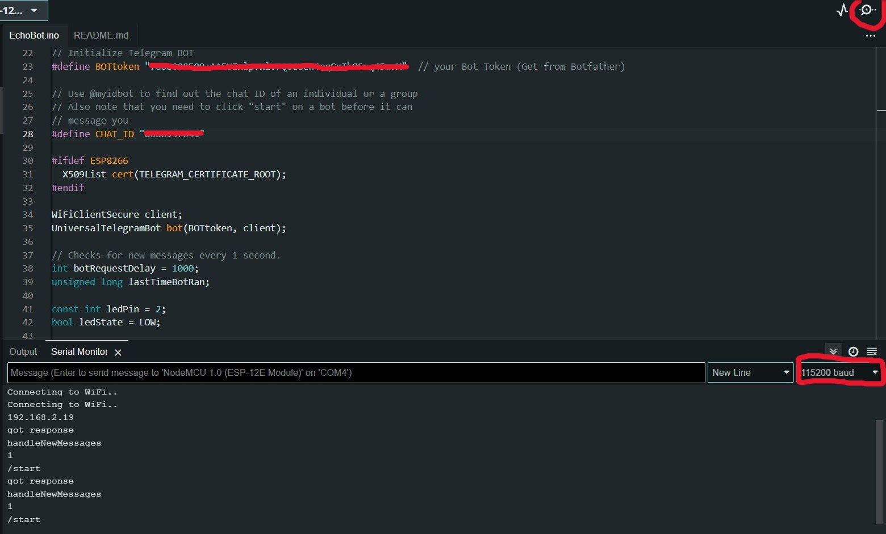

# Node MCU Show Me Love

## Introduction
The goal is to have your nodes communicate in pairs. Node 1 sends something to node 2 and it responds by sending it to an output (LED strip, vibrating motor, etc.).

### What do you need?
* 2x NodeMCU Arduino Board, ESP8266
* Arduino IDE
* 2x Micro USB cable
* WIFI connection
* Key Switch Sensor

Like this one:


* Adafruit IO account

## Step 1: Make a Feed in Adafruit 
If you not yet have an account on Adafruit: go to the [website](https://io.adafruit.com/), click on "Get started for free" and follow the steps


After creating your account, you will be directed to your Account Settings. From there, navigate to IO > Feed > New Feed.


A new window will now appear. Enter a name for your Feed and write a brief description. I’ll name mine "Kussiekussielove." Then, click "Create" to finalize the Feed.


## Step 2: Adafruit Library
Open up Arduino and go to Sketch > Include Library > Manage Libraries. 


Search for Adafruit IO Arduino by Adafruit and click on Install.


To open up this downloaded library go to File > Examples > Adafruit IO Arduino > Adafruitio_20_shared_feed_write. To find Adafruit IO Arduino scroll down all the down. 


Now you should see this code:

``` cpp
// Adafruit IO Shared Feeds Write Example
// desc: Example of writing a button value to a shared feed.
//
// Tutorial Link: https://learn.adafruit.com/adafruit-io-basics-feeds/sharing-a-feed
//
// Adafruit invests time and resources providing this open source code.
// Please support Adafruit and open source hardware by purchasing
// products from Adafruit!
//
// Written by Brent Rubell for Adafruit Industries
// Copyright (c) 2018 Adafruit Industries
// Licensed under the MIT license.
//
// All text above must be included in any redistribution.

/************************** Configuration ***********************************/

// edit the config.h tab and enter your Adafruit IO credentials
// and any additional configuration needed for WiFi, cellular,
// or ethernet clients.
#include "config.h"

/************************ Example Starts Here *******************************/

// digital pin 5
#define BUTTON_PIN 5

// the Adafruit IO username of whomever owns the feed
#define FEED_OWNER "AIO_FEED_OWNER"

// set up a shared feed between you and the FEED_OWNER 
// make sure you have both read AND write access to this feed
AdafruitIO_Feed *sharedFeed = io.feed("FEED-NAME", FEED_OWNER);

// button state
bool current = false;
bool last = false;

void setup() {

  // set button pin as an input
  pinMode(BUTTON_PIN, INPUT);

  // start the serial connection
  Serial.begin(115200);

  // wait for serial monitor to open
  while(! Serial);

  // connect to io.adafruit.com
  Serial.print("Connecting to Adafruit IO");
  io.connect();

  // wait for a connection
  while(io.status() < AIO_CONNECTED) {
    Serial.print(".");
    delay(500);
  }

  // we are connected
  Serial.println();
  Serial.println(io.statusText());

}

void loop() {

  // io.run(); is required for all sketches.
  // it should always be present at the top of your loop
  // function. it keeps the client connected to
  // io.adafruit.com, and processes any incoming data.
  io.run();

  // grab the current state of the button.
  // we have to flip the logic because we are
  // using a pullup resistor.
  if(digitalRead(BUTTON_PIN) == LOW)
    current = true;
  else
    current = false;

  // return if the value hasn't changed
  if(current == last)
    return;

  // save the current state to the 'sharedFeed' feed on adafruit io
  Serial.print("sending button -> ");
  Serial.println(current);
  sharedFeed->save(current);

  // store last button state
  last = current;

}
```

## Step 3: Port and Board
Choose for the NodeMCU 1.0 (ESP-12E Module) and your connected port. To find this go to Tools > Board > esp8266 > NodeMCU 1.0 (ESP-12E Module).


For the port you also go to Tools > Port and select the right Port. It could be that you don't have any connection and your Port is disabled like this:


There are some things you can do to fix that:
* Check the USB cable: Ensure you're using a data cable, not just a charging cable. Try a different USB cable if possible.
* Install drivers: NodeMCU usually needs CH340G or CP210x drivers.
Download and install the appropriate driver for your board.
* Restart your computer:
* Select the correct board
Try different USB ports
* Update Arduino IDE
* Check Windows security (Windows): Sometimes Windows security can block new USB devices.

## Step 4: Install Key Switch
Connect your push button: S (signal) to D0, - to GND and the other pin to 3.3V. So like this:


Now change 

``` cpp
// digital pin 5
#define BUTTON_PIN 5
```

to:

``` cpp
// digital pin D0
#define BUTTON_PIN D0
```
And fill in your account name in "AIO_FEED_OWNER" and "FEED-NAME" 

``` cpp
// the Adafruit IO username of whomever owns the feed
#define FEED_OWNER "AIO_FEED_OWNER"

// set up a shared feed between you and the FEED_OWNER 
// make sure you have both read AND write access to this feed
AdafruitIO_Feed *sharedFeed = io.feed("FEED-NAME", FEED_OWNER);
```

In the config.h tab, you need to fill in your account name and key from Adafruit. But also your WIFI information. To get there click the tab next to adafruitio_20_shared_feed_write.ino.  


To find your key go to your account in Adafruit IO and click on the Yellow Key button. Now you see your username and IO Key. Copy this and put it in the config.h file.


## Step 5: Upload the code
Upload your code and open the Serial Monitor to verify if your WiFi is functioning. To upload the code, click the blue arrow in the top left corner. 


To see if it worked go to your Serial Monitor and click your Key Switch. You can see a row of 1 and 0. If you see nothing happening, it could be that you have the wrong baud selected. In the code it is 115200 but the file says 9600 baud. So try changing that.


Upload the code again and you should see this:


Since the connection worked you can see the time you click on the button on your account of Adafruit. You can even see how long the button was pressed.


## Problem solving
### Serial Monitor
Can't see the Serial Monitor working? It could be that the wrong baud is sellected. Check the baud on your right, this should be 115200.


Having trouble locating the Serial Monitor? Click on the icon in the top right corner to open it. Then, set the baud rate to 115200 at the bottom. Upload the code again, and you should see the connection being established.



### Port
Do you get an error message about your port not being connected but you got the board right? 


There are some things you can do to fix that:
* Check the USB cable: Ensure you're using a data cable, not just a charging cable. Try a different USB cable if possible.
* Install drivers: NodeMCU usually needs CH340G or CP210x drivers.
Download and install the appropriate driver for your board.
* Restart your computer
* Select the correct board
Try different USB ports
* Update Arduino IDE
* Check Windows security (Windows): Sometimes Windows security can block new USB devices

## Sources
* [OpenWeather](https://openweathermap.org/)
* [DfETsrIOT Show me Love](https://icthva.sharepoint.com/:w:/s/FDMCI_ORG__CMD-Amsterdam/ESGyAezw-g9Nu46CfppUhk8BYspIz1gFlXjr0YSv6hBpNg?e=U5EPx7)


