# Telegram Adafruit ESP8266 

## Introduction
This guide shows how to control the ESP32 or ESP8266 NodeMCU GPIOs from anywhere in the world using Telegram. As an example, we’ll control an LED, but you can control any other output. You just need to send a message to your Telegram Bot to set your outputs HIGH or LOW. The ESP boards will be programmed using Arduino IDE.

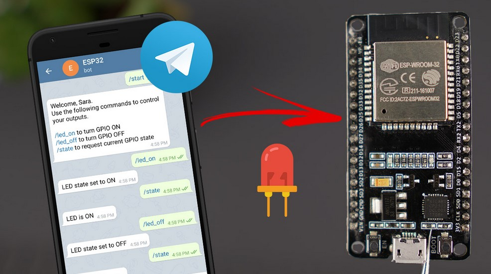

### What do you need?
* NodeMCU Arduino Board, ESP8266
* LED strip
* Arduino IDE
* WIFI connection
* Micro USB cable

## Step 1: Making a bot
Go to Google Play or App Store, download and install Telegram. 


Open Telegram and follow the next steps to create a Telegram Bot. First, search for “botfather” and click the BotFather as shown below. Or open this link t.me/botfather in your smartphone. 


The following window should open and you’ll be prompted to click the start button.

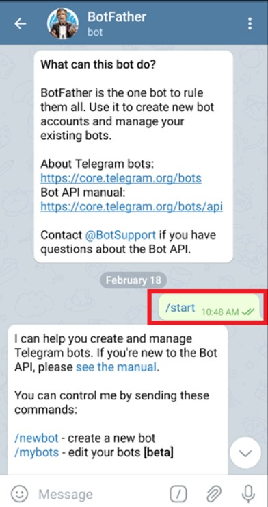

Type /newbot and follow the instructions to create your bot. Give it a name and username. 

If your bot is successfully created, you’ll receive a message with a link to access the bot and the bot token. Save the bot token because you’ll need it so that the ESP32/ESP8266 can interact with the bot.

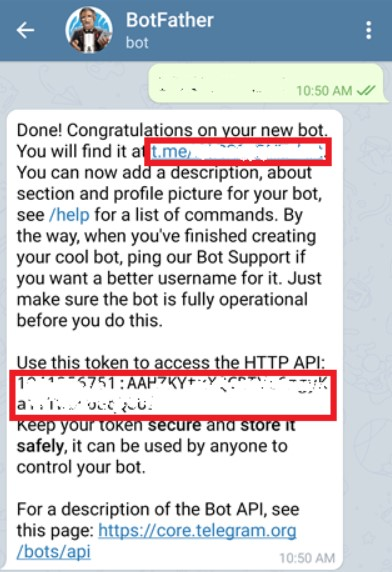

### Get your Telegram User ID
Anyone that knows your bot username can interact with it. To make sure that we ignore messages that are not from our Telegram account (or any authorized users), you can get your Telegram User ID. Then, when your telegram bot receives a message, the ESP can check whether the sender ID corresponds to your User ID and handle the message or ignore it.

In your Telegram account, search for “IDBot” or open this link t.me/myidbot in your smartphone.


Start a conversation with that bot and type /getid. You will get a reply back with your user ID. Save that user ID, because you’ll need it later in this tutorial.

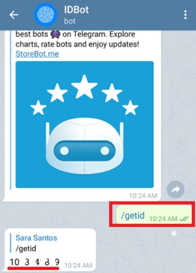

## Step 2: Add Libraries 
To interact with the Telegram bot, we’ll use the Universal Telegram Bot Library created by Brian Lough that provides an easy interface for the Telegram Bot API. And we also need AruinoJson.

### ArduinoJson
Go to Sketch > Include Library > Manage Libraries and add “ArduinoJson” Benoit Blanchon. We are using version 5.13.5.

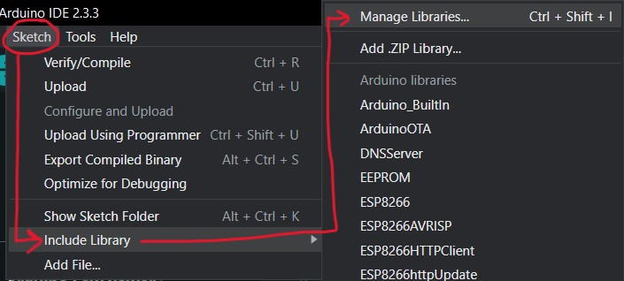


### Universal Telegram Bot
And add the 'universal telegram bot' via the 'Library Manager' of Arduino.
Choose for the 1.1.0 version

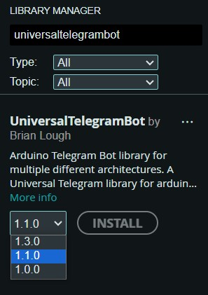

## Step 3: Echobot
Open 'echobot' via File > Examples > UniversalTelegramBot > ESP8266 > EchoBot

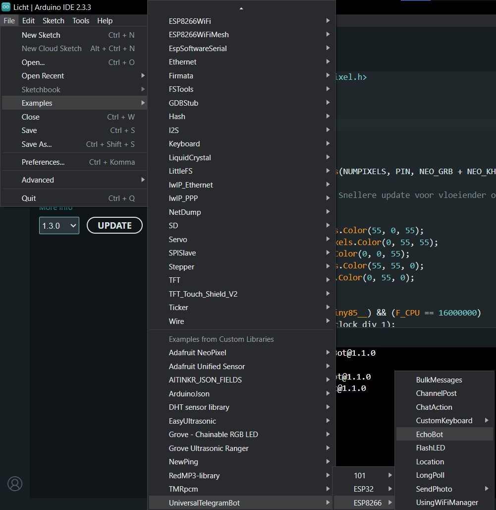

You may have code like below, the code is correct, but some data and the code about messages are not included.

```cpp
/*******************************************************************
*  An example of bot that echos back any messages received         *
*                                                                  *
*  written by Giacarlo Bacchio (Gianbacchio on Github)             *
*  adapted by Brian Lough                                          *
*******************************************************************/
#include <ESP8266WiFi.h>
#include <WiFiClientSecure.h>
#include <UniversalTelegramBot.h>

// Initialize Wifi connection to the router
char ssid[] = "XXXXXXX";     // your network SSID (name)
char password[] = "XXXXXXXXX"; // your network key

// Initialize Telegram BOT
#define BOTtoken "XXXXXXXXXX"  // your Bot Token (Get from Botfather)

WiFiClientSecure client;
UniversalTelegramBot bot(BOTtoken, client);

int Bot_mtbs = 1000; //mean time between scan messages
long Bot_lasttime;   //last time messages' scan has been done

void setup() {
  Serial.begin(115200);

  // Set WiFi to station mode and disconnect from an AP if it was Previously
  // connected
  WiFi.mode(WIFI_STA);
  WiFi.disconnect();
  delay(100);

  // Attempt to connect to Wifi network:
  Serial.print("Connecting Wifi: ");
  Serial.println(ssid);
  WiFi.begin(ssid, password);

  while (WiFi.status() != WL_CONNECTED) {
    Serial.print(".");
    delay(500);
  }

  Serial.println("");
  Serial.println("WiFi connected");
  Serial.print("IP address: ");
  Serial.println(WiFi.localIP());
}

void loop() {
  if (millis() > Bot_lasttime + Bot_mtbs)  {
    int numNewMessages = bot.getUpdates(bot.last_message_received + 1);

    while(numNewMessages) {
      Serial.println("got response");
      for (int i=0; i<numNewMessages; i++) {
        bot.sendMessage(bot.messages[i].chat_id, bot.messages[i].text, "");
      }
      numNewMessages = bot.getUpdates(bot.last_message_received + 1);
    }

    Bot_lasttime = millis();
  }
}

```

The following code allows you to control your ESP32 or ESP8266 NodeMCU GPIOs by sending messages to a Telegram Bot. To make it work for you, you need to enter your network details (SSID and password), the Telegram Bot Token and your Telegram user ID.

```cpp
/*
  Rui Santos
  Complete project details at https://RandomNerdTutorials.com/telegram-control-esp32-esp8266-nodemcu-outputs/
  
  Project created using Brian Lough's Universal Telegram Bot Library: https://github.com/witnessmenow/Universal-Arduino-Telegram-Bot
  Example based on the Universal Arduino Telegram Bot Library: https://github.com/witnessmenow/Universal-Arduino-Telegram-Bot/blob/master/examples/ESP8266/FlashLED/FlashLED.ino
*/

#ifdef ESP32
  #include <WiFi.h>
#else
  #include <ESP8266WiFi.h>
#endif
#include <WiFiClientSecure.h>
#include <UniversalTelegramBot.h>   // Universal Telegram Bot Library written by Brian Lough: https://github.com/witnessmenow/Universal-Arduino-Telegram-Bot
#include <ArduinoJson.h>

// Replace with your network credentials
const char* ssid = "REPLACE_WITH_YOUR_SSID";
const char* password = "REPLACE_WITH_YOUR_PASSWORD";

// Initialize Telegram BOT
#define BOTtoken "XXXXXXXXXX:XXXXXXXXXXXXXXXXXXXXXXXXXXXXXXXXXXX"  // your Bot Token (Get from Botfather)

// Use @myidbot to find out the chat ID of an individual or a group
// Also note that you need to click "start" on a bot before it can
// message you
#define CHAT_ID "XXXXXXXXXX"

#ifdef ESP8266
  X509List cert(TELEGRAM_CERTIFICATE_ROOT);
#endif

WiFiClientSecure client;
UniversalTelegramBot bot(BOTtoken, client);

// Checks for new messages every 1 second.
int botRequestDelay = 1000;
unsigned long lastTimeBotRan;

const int ledPin = 2;
bool ledState = LOW;

// Handle what happens when you receive new messages
void handleNewMessages(int numNewMessages) {
  Serial.println("handleNewMessages");
  Serial.println(String(numNewMessages));

  for (int i=0; i<numNewMessages; i++) {
    // Chat id of the requester
    String chat_id = String(bot.messages[i].chat_id);
    if (chat_id != CHAT_ID){
      bot.sendMessage(chat_id, "Unauthorized user", "");
      continue;
    }
    
    // Print the received message
    String text = bot.messages[i].text;
    Serial.println(text);

    String from_name = bot.messages[i].from_name;

    if (text == "/start") {
      String welcome = "Welcome, " + from_name + ".\n";
      welcome += "Use the following commands to control your outputs.\n\n";
      welcome += "/led_on to turn GPIO ON \n";
      welcome += "/led_off to turn GPIO OFF \n";
      welcome += "/state to request current GPIO state \n";
      bot.sendMessage(chat_id, welcome, "");
    }

    if (text == "/led_on") {
      bot.sendMessage(chat_id, "LED state set to ON", "");
      ledState = HIGH;
      digitalWrite(ledPin, ledState);
    }
    
    if (text == "/led_off") {
      bot.sendMessage(chat_id, "LED state set to OFF", "");
      ledState = LOW;
      digitalWrite(ledPin, ledState);
    }
    
    if (text == "/state") {
      if (digitalRead(ledPin)){
        bot.sendMessage(chat_id, "LED is ON", "");
      }
      else{
        bot.sendMessage(chat_id, "LED is OFF", "");
      }
    }
  }
}

void setup() {
  Serial.begin(115200);

  #ifdef ESP8266
    configTime(0, 0, "pool.ntp.org");      // get UTC time via NTP
    client.setTrustAnchors(&cert); // Add root certificate for api.telegram.org
  #endif

  pinMode(ledPin, OUTPUT);
  digitalWrite(ledPin, ledState);
  
  // Connect to Wi-Fi
  WiFi.mode(WIFI_STA);
  WiFi.begin(ssid, password);
  #ifdef ESP32
    client.setCACert(TELEGRAM_CERTIFICATE_ROOT); // Add root certificate for api.telegram.org
  #endif
  while (WiFi.status() != WL_CONNECTED) {
    delay(1000);
    Serial.println("Connecting to WiFi..");
  }
  // Print ESP32 Local IP Address
  Serial.println(WiFi.localIP());
}

void loop() {
  if (millis() > lastTimeBotRan + botRequestDelay)  {
    int numNewMessages = bot.getUpdates(bot.last_message_received + 1);

    while(numNewMessages) {
      Serial.println("got response");
      handleNewMessages(numNewMessages);
      numNewMessages = bot.getUpdates(bot.last_message_received + 1);
    }
    lastTimeBotRan = millis();
  }
}
```

The code is compatible with ESP32 and ESP8266 NodeMCU boards (it’s based on the Universal Arduino Telegram Bot library example). The code will load the right libraries accordingly to the selected board.

### WIFI credentials
Insert your network credentials in the following variables.

```cpp 
// Initialize Wifi connection to the router
char ssid[] = "XXXXXX";     // your network SSID (name)
char password[] = "YYYYYY"; // your network key
```

### Telegram Bot Token
Insert your Telegram Bot token you’ve got from Botfather on the BOTtoken variable.

```cpp 
#define BOTtoken "XXXXXXXXXX:XXXXXXXXXXXXXXXXXXXXXXXXXXXXXXXXXXX"  // your Bot Token (Get from Botfather)
```

### Telegram User ID
Insert your chat ID. The one you’ve got from the IDBot.

```cpp 
#define CHAT_ID "XXXXXXXXXX"
```

Upload your code, open the serial monitor. Check here whether your WiFi works.

(uitleg uploaden)

## Step 4: Port and Board

## Step 5: Chat with Bot
If you now send a message from Telegram to your bot, your ESP will listen and send the message back as an echo to Telegram Bot.

(laten zien)

Now display the text in your serial monitor, within the for loop you do a


```cpp
Serial.println(bot.messages[i].text);
```

You can edit within the loop of numNewMessages to add intelligence and customize the text it returns. Try sending an additional message using a second call to sendMessage. 

```cpp
bot.sendMessage(bot.messages[i].chat_id, "Are you alright comrade?", "");
```

## Step 6: LED Light

Configure the built-in LED as output, add the following code to the void setup:

```cpp
pinMode(LED_BUILTIN, OUTPUT); // Initialize the LED_BUILTIN pin as an output
```

We are now going to apply rudimentary intelligence. Within the same loop we create an if / else if that listens to .text value.

If this value is equal to your command, for example “lights on”, turn on the built-in LED 
```cpp
(LED_BUILTIN = LOW)
``` 
Also think of what text you want in the else if to turn it off (HIGH).

### Connect the LED's
Examine the LED strip included in the kit. If you look very closely you will see the following text next to each LED:

* +5v represents the current
* Din stands for a digital signal
* G Stands for ground (earth)

Three cables are connected to one of the ends of the LED strip:

* There is a red wire on the +5v
* There is a yellow wire on the Din
* There is a black wire on the G

The LED strip works on direct current and just like a battery, the LED strip has a plus and a minus. The plus here is +5v and the minus is the G. The digital signal Din is the input to send your command.

Study your NodeMcu. On the dark side of the board it says in small text next to the pins what they are for.

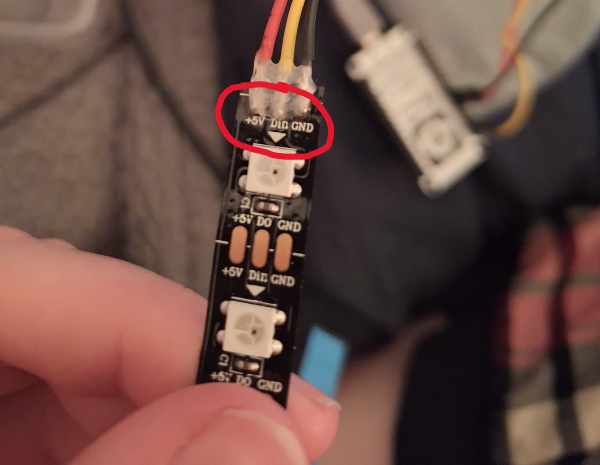

1. Connect the Din (yellow) of your LED strip to the D1 pin of your NodeMcu

2. Connect the +5V (red) of your LED strip to one of the 3v (3 volt) pins of your NodeMcu

3. Connect the G (black) of your LED strip to the G next to the 3v pin. This may also be a different G pin, but it is clearer and easier to use them side by side

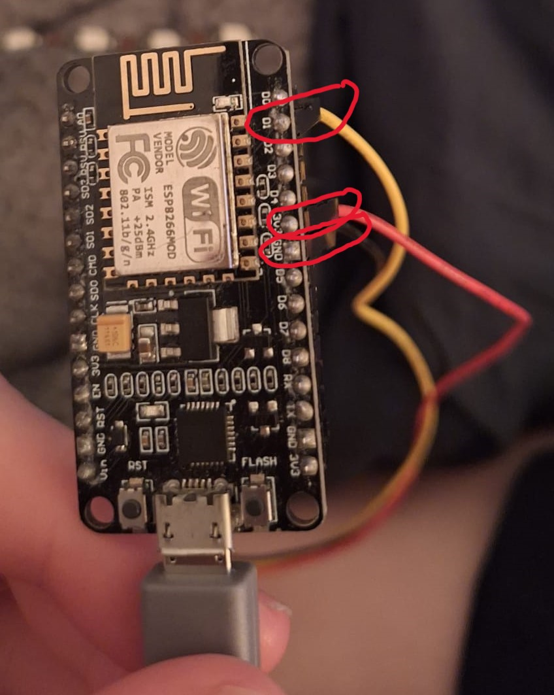

## Step 7: Turn The Lights On!
Now open your Telegram application on your smartphone. Type /start and press enter to send it to your newly created bot. As a result, this will show you a welcome message from the bot. All the different commands will be displayed which you can enter one by one.

* Send /led2_on to turn GPIO2 ON
* Send /led2_off to turn GPIO2 OFF
* Send /get_state to request the current GPIO state

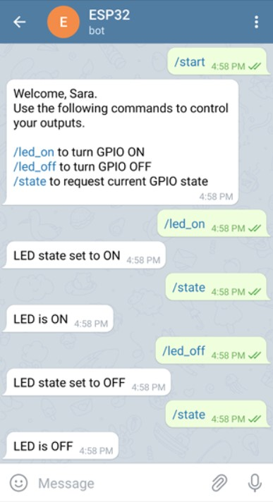

## Sources
* [DfETsr IOT Telegram](https://icthva.sharepoint.com/:w:/r/sites/FDMCI_ORG__CMD-Amsterdam/_layouts/15/Doc.aspx?sourcedoc=%7B6e77c9be-5af2-4c98-b951-5b30757ff56a%7D&action=view&wdAccPdf=0&wdparaid=1A6631C3)
* [Random Nerd Tutorials Telegram](https://randomnerdtutorials.com/telegram-control-esp32-esp8266-nodemcu-outputs/)
* [Microcontrollerslab Telegram](https://microcontrollerslab.com/telegram-esp32-esp8266-nodemcu-control-gpios-leds/)

## What went wrong?
What i saw when downloading Universal Telegram Bot was:

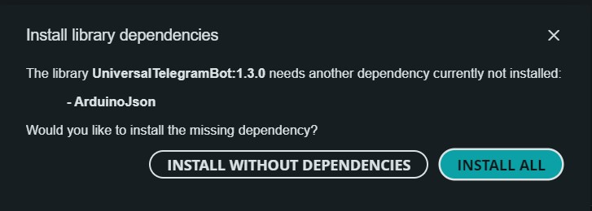

Eventhough i already downloaded ArduinoJson, so when i tried the 1.1.0 version of Universal Telegram Bot i did work. But now i dont use the latest version of ArduinoJson because that wasn't compatible with the 1.3.0 version for some reason. And the 1.1.0 version of Universal Telegram only was compatible with the 5.13.5 version of ArduinoJson, so used that. 


