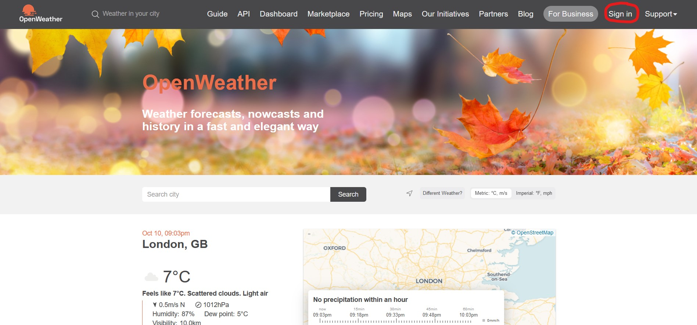
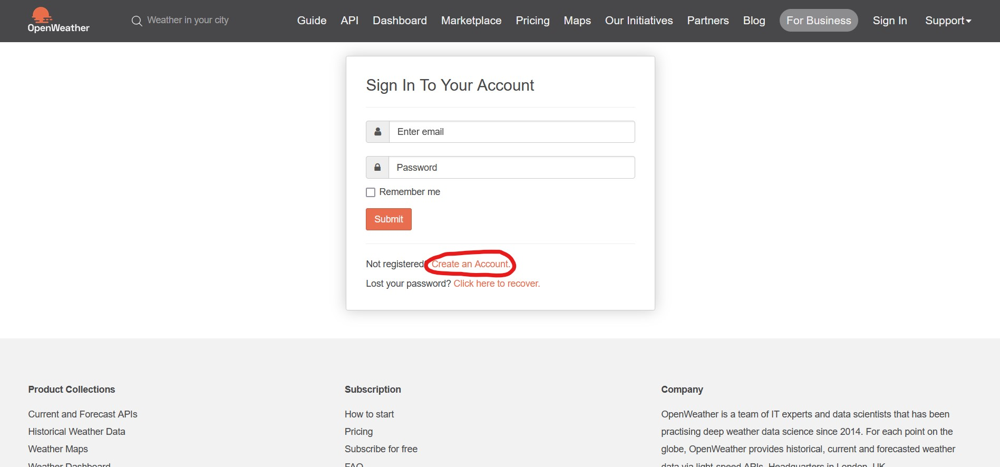
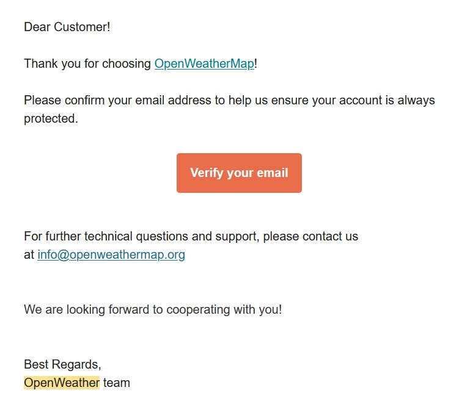
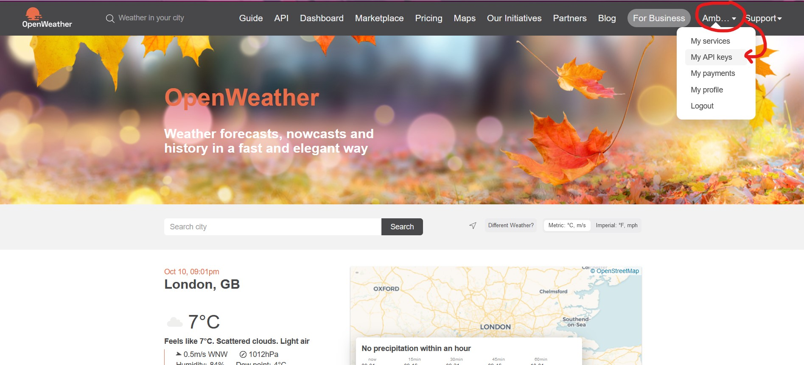
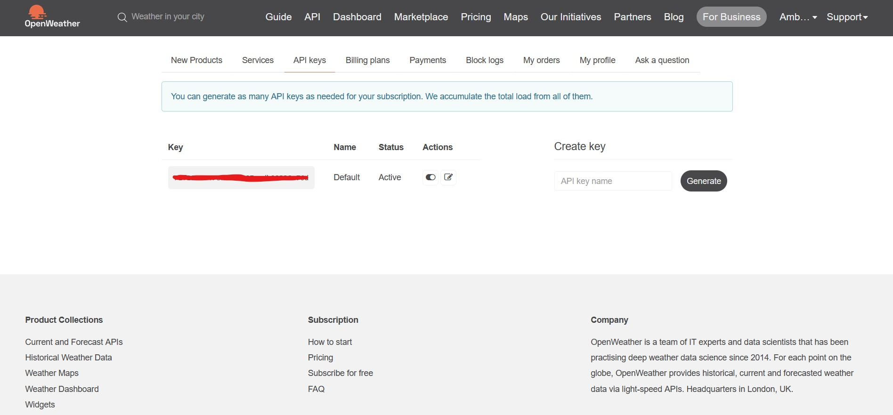
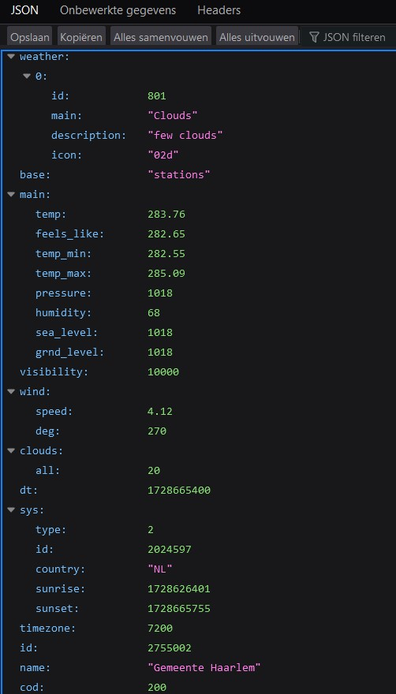
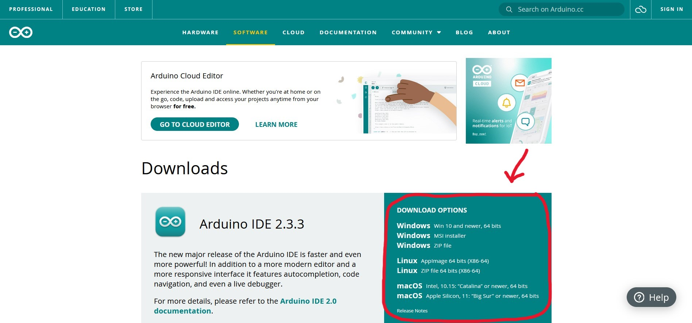
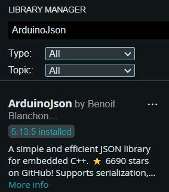

# Smart Breeze

## Introduction
In this project we create a simulation of a smart ventilator with a NodeMCU and the OpenWeatherMap API. The goal is to collect real-time weather data, such as temperature, and send notifications. 

We connect the NodeMCU to WiFi to request the current temperature of a specific location via the internet. If the temperature rises above a certain degree, the system switches "on", and if the temperature drops, it switches "off". These messages become visible in the Serial Monitor of the Arduino IDE. 

In this manual I will tell you how to build this. 

### What do you need?
* NodeMCU Arduino Board (ESP32)
* WiFi-verbinding
* API-key from [OpenWeatherMap](https://openweathermap.org/)
* Key from [IFTTT](https://ifttt.com/) (Sending automatic notifications)

## Step 1: Get API from OpenWeatherMap
### Create an account
First we make an account on [OpenweatherMap](https://openweathermap.org/). Go to "Sign Up", click on "Create an Account" and follow the steps.





After you've created an account make sure to verify your email in your mailbox. Otherwise your API Key won't work.



Once you come back to the OpenWeatherMap website you should see that your account has been verified. 


### API Key
Note: API keys are unique to the user and shouldn’t be shared with anyone.

To find your API Key go to your account name and click on "My API Keys"





### Weather information
To pull information on weather in your chosen location, enter the following URL:

``` cpp
http://api.openweathermap.org/data/2.5/weather?q=yourCityName,yourCountryCode&APPID=yourUniqueAPIkey
```
Replace yourCityName with the city you want data for, yourCountryCode with the country code for that city, and yourUniqueAPIkey with the unique API key from step 4. For example, the updated API URL for the city Haarlem, Netherlands, would be: 

``` cpp
http://api.openweathermap.org/data/2.5/weather?q=Haarlem,
NL&APPID=801d2603e9f2e1c70e042e4f5f6e0---
```
Copy your URL into your browser, and the API will return a bunch of information corresponding to your local weather. This is how it looks:



You’ll see how to use this information to get specific data like temperature, humidity, pressure, wind speed, etc.

## Step 2: Install Arduino IDE and libraries
If you don't yet have Arduino IDE installed, download it [here](https://www.arduino.cc/en/software) and choose the right Operating system for you.



You also need to install the Arduino_JSON library. You can install this library in the Arduino IDE Library Manager. Just go to Sketch > Include Library > Manage Libraries and search for "ArduinoJson" by Benoit Blanchon. Download the latest version.




## Step 3: Connecting to OpenWeatherMap
After installing the necessary libraries, copy the following code to your Arduino IDE, but don’t upload it yet. You need to make some changes to make it work for you.

``` cpp
/*
  Rui Santos
  Complete project details at Complete project details at https://RandomNerdTutorials.com/esp32-http-get-open-weather-map-thingspeak-arduino/

  Permission is hereby granted, free of charge, to any person obtaining a copy
  of this software and associated documentation files.

  The above copyright notice and this permission notice shall be included in all
  copies or substantial portions of the Software.
*/

#include <WiFi.h>
#include <HTTPClient.h>
#include <Arduino_JSON.h>

const char* ssid = "REPLACE_WITH_YOUR_SSID";
const char* password = "REPLACE_WITH_YOUR_PASSWORD";

// Your Domain name with URL path or IP address with path
String openWeatherMapApiKey = "REPLACE_WITH_YOUR_OPEN_WEATHER_MAP_API_KEY";
// Example:
//String openWeatherMapApiKey = "bd939aa3d23ff33d3c8f5dd1dd435";

// Replace with your country code and city
String city = "Haarlem";
String countryCode = "NL";

// THE DEFAULT TIMER IS SET TO 10 SECONDS FOR TESTING PURPOSES
// For a final application, check the API call limits per hour/minute to avoid getting blocked/banned
unsigned long lastTime = 0;
// Timer set to 10 minutes (600000)
//unsigned long timerDelay = 600000;
// Set timer to 10 seconds (10000)
unsigned long timerDelay = 10000;

String jsonBuffer;

void setup() {
  Serial.begin(115200);

  WiFi.begin(ssid, password);
  Serial.println("Connecting");
  while(WiFi.status() != WL_CONNECTED) {
    delay(500);
    Serial.print(".");
  }
  Serial.println("");
  Serial.print("Connected to WiFi network with IP Address: ");
  Serial.println(WiFi.localIP());
 
  Serial.println("Timer set to 10 seconds (timerDelay variable), it will take 10 seconds before publishing the first reading.");
}

void loop() {
  // Send an HTTP GET request
  if ((millis() - lastTime) > timerDelay) {
    // Check WiFi connection status
    if(WiFi.status()== WL_CONNECTED){
      String serverPath = "http://api.openweathermap.org/data/2.5/weather?q=" + city + "," + countryCode + "&APPID=" + openWeatherMapApiKey;
      
      jsonBuffer = httpGETRequest(serverPath.c_str());
      Serial.println(jsonBuffer);
      JSONVar myObject = JSON.parse(jsonBuffer);
  
      // JSON.typeof(jsonVar) can be used to get the type of the var
      if (JSON.typeof(myObject) == "undefined") {
        Serial.println("Parsing input failed!");
        return;
      }
    
      Serial.print("JSON object = ");
      Serial.println(myObject);
      Serial.print("Temperature: ");
      Serial.println(myObject["main"]["temp"]);
      Serial.print("Pressure: ");
      Serial.println(myObject["main"]["pressure"]);
      Serial.print("Humidity: ");
      Serial.println(myObject["main"]["humidity"]);
      Serial.print("Wind Speed: ");
      Serial.println(myObject["wind"]["speed"]);
    }
    else {
      Serial.println("WiFi Disconnected");
    }
    lastTime = millis();
  }
}

String httpGETRequest(const char* serverName) {
  WiFiClient client;
  HTTPClient http;
    
  // Your Domain name with URL path or IP address with path
  http.begin(client, serverName);
  
  // Send HTTP POST request
  int httpResponseCode = http.GET();
  
  String payload = "{}"; 
  
  if (httpResponseCode>0) {
    Serial.print("HTTP Response code: ");
    Serial.println(httpResponseCode);
    payload = http.getString();
  }
  else {
    Serial.print("Error code: ");
    Serial.println(httpResponseCode);
  }
  // Free resources
  http.end();

  return payload;
}
```
Modify the next lines with your network credentials: SSID and password. The code is well commented on where you should make the changes.

``` cpp
// Replace with your network credentials
const char* ssid     = "REPLACE_WITH_YOUR_SSID";
const char* password = "REPLACE_WITH_YOUR_PASSWORD";
```

Insert your API key in the following like:

``` cpp
String openWeatherMapApiKey = "REPLACE_WITH_YOUR_OPEN_WEATHER_MAP_API_KEY";
```

Enter the city you want to get data for, as well as the country code in the following variables:

``` cpp
// Replace with your country code and city
String city = "Haarlem";
String countryCode = "NL";
```

After making these changes, you can upload the code to your board.

## Step 4: IFTTT Applet

## Step 5: Getting notifications

## Sources
* https://openweathermap.org/current#geo
* https://randomnerdtutorials.com/esp32-http-get-open-weather-map-thingspeak-arduino/
* https://ifttt.com/explore/weather-automations
* https://www.learnrobotics.org/blog/connect-arduino-to-ifttt-for-iot-projects/

