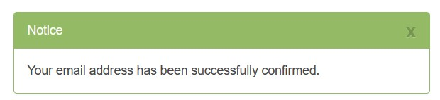

# Smart Breeze

## Introduction
In this project we create a simulation of a smart ventilator with a NodeMCU and the OpenWeatherMap API. The goal is to collect real-time weather data, such as temperature, and send notifications. 

We connect the NodeMCU to WiFi to request the current temperature of a specific location via the internet. If the temperature rises above a certain degree, the system switches "on", and if the temperature drops, it switches "off". These messages become visible in the Serial Monitor of the Arduino IDE. 

In this manual I will tell you how to build this. 

### What do you need?
* NodeMCU Arduino Board (ESP32)
* WiFi-verbinding
* API-key from [OpenWeatherMap](https://openweathermap.org/)
* Key from [IFTTT](https://ifttt.com/) (Sending automatic notifications)

## Step 1: Get API from OpenWeatherMap
### Create an account
First we make an account on [OpenweatherMap](https://openweathermap.org/). Go to "Sign Up", click on "Create an Account" and follow the steps.


After you've created an account make sure to verify your email in your mailbox. Otherwise your API Key won't work.


Once you come back to the OpenWeatherMap website you should see that your account has been verified. 



### API Key
Note: API keys are unique to the user and shouldn’t be shared with anyone.

To find your API Key go to your account name and click on "My API Keys"


### Weather information
To pull information on weather in your chosen location, enter the following URL:

``` cpp
http://api.openweathermap.org/data/2.5/weather?q=yourCityName,yourCountryCode&APPID=yourUniqueAPIkey
```
Replace yourCityName with the city you want data for, yourCountryCode with the country code for that city, and yourUniqueAPIkey with the unique API key from step 4. For example, the updated API URL for the city Haarlem, Netherlands, would be: 

``` cpp
http://api.openweathermap.org/data/2.5/weather?q=Haarlem,
NL&APPID=801d2603e9f2e1c70e042e4f5f6e0---
```
Copy your URL into your browser, and the API will return a bunch of information corresponding to your local weather. This is how it looks:


You’ll see how to use this information to get specific data like temperature, humidity, pressure, wind speed, etc.

## Step 2: Install Arduino IDE and libraries
If you don't yet have Arduino IDE installed, download it [here](https://www.arduino.cc/en/software) and choose the right Operating system for you.


You also need to install the Arduino_JSON library. You can install this library in the Arduino IDE Library Manager. Just go to Sketch > Include Library > Manage Libraries and search for "ArduinoJson" by Benoit Blanchon. Download the latest version.


## Step 3: Connecting to OpenWeatherMap

## Step 4: IFTTT Applet

## Step 5: Getting notifications

## Sources
* https://openweathermap.org/current#geo
* https://randomnerdtutorials.com/esp32-http-get-open-weather-map-thingspeak-arduino/
* https://ifttt.com/explore/weather-automations
* https://www.learnrobotics.org/blog/connect-arduino-to-ifttt-for-iot-projects/

