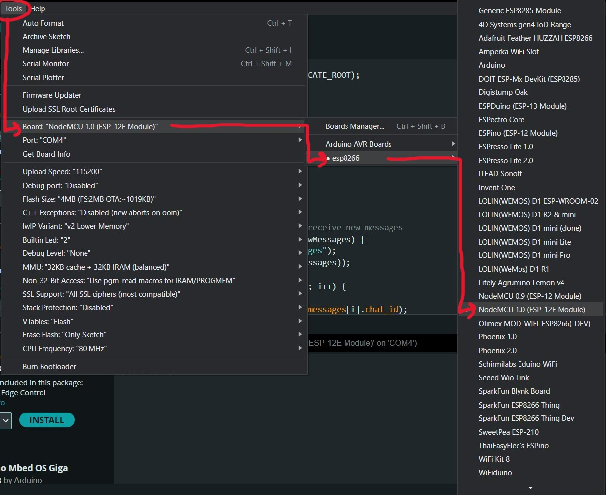
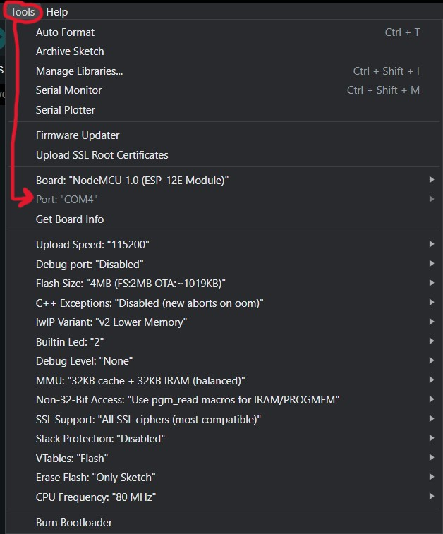
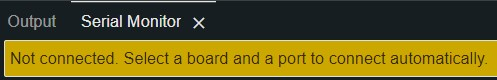
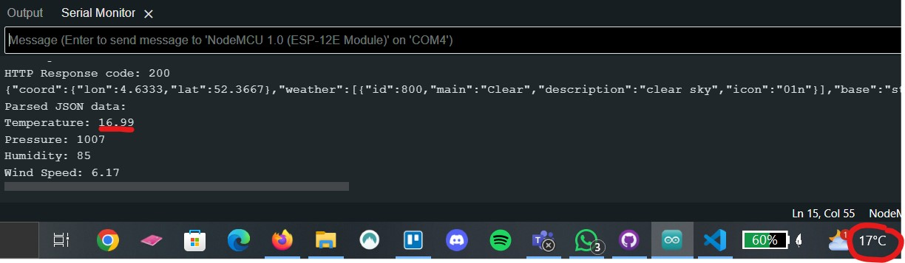
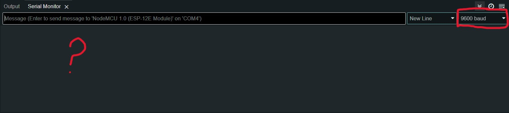
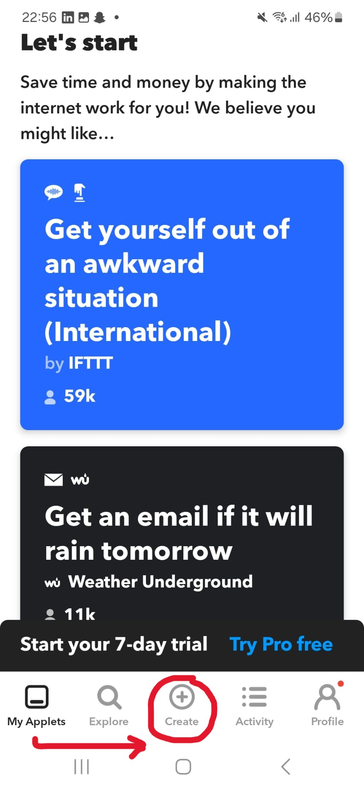
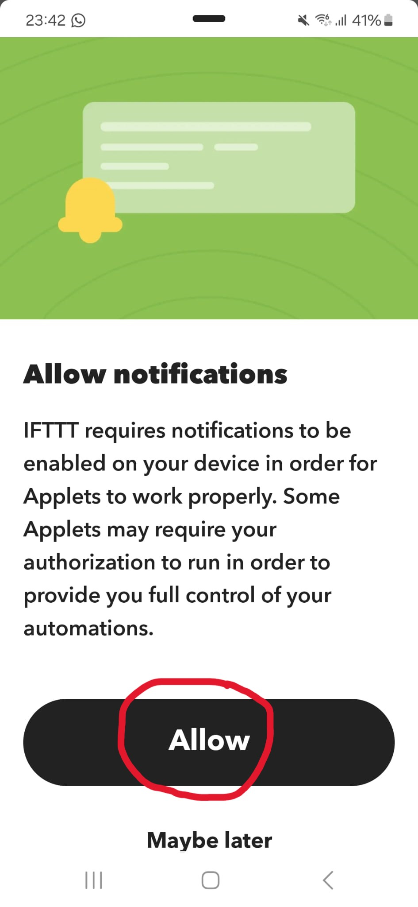
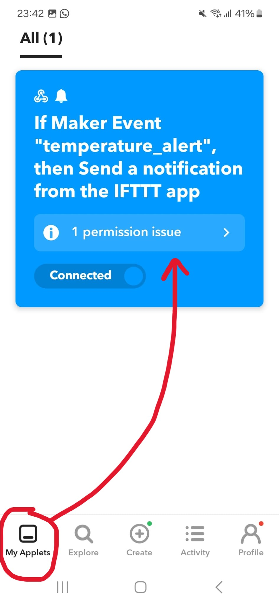
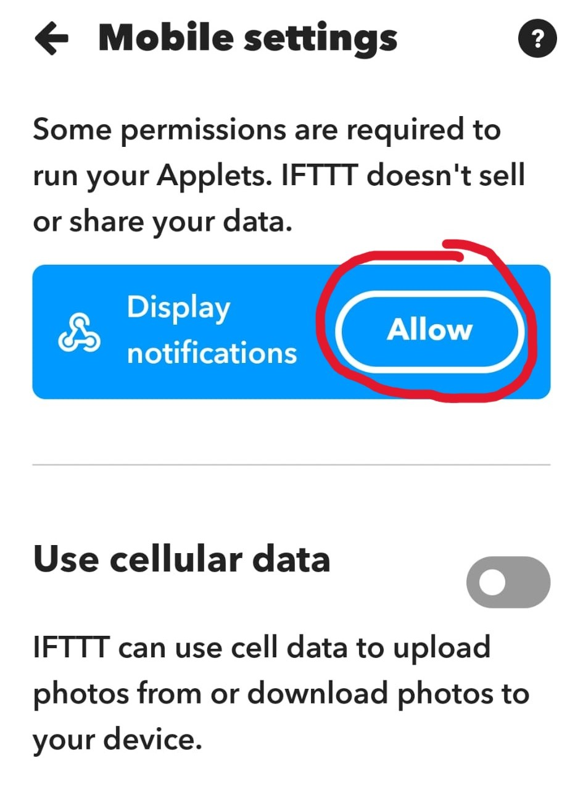

# :wind_face::globe_with_meridians: Smart Breeze

## Introduction
In this project we create a simulation of a smart ventilator with a NodeMCU and the OpenWeatherMap API. The goal is to collect real-time weather data, such as temperature, and send notifications. 

We connect the NodeMCU to WiFi to request the current temperature of a specific location via the internet. If the temperature rises above a certain degree, the system switches "on", and if the temperature drops, it switches "off". These messages become visible in the Serial Monitor of the Arduino IDE. 

This project is mainly for the ESP32 Board but i have rebuild the code so you can also use it for the ESP8266 Board.

In this manual I will tell you to get the notification on your phone through Arduino. 

### What do you need?
* NodeMCU Arduino Board (ESP32 or ESP8266)
* WiFi-verbinding
* API-key from [OpenWeatherMap](https://openweathermap.org/)
* Key from [IFTTT](https://ifttt.com/) (Sending automatic notifications)

## :globe_with_meridians: Step 1: Get API from OpenWeatherMap
### Create an account
First we make an account on [OpenweatherMap](https://openweathermap.org/). Go to "Sign Up", click on "Create an Account" and follow the steps.


After you've created an account make sure to verify your email in your mailbox. Otherwise your API Key won't work.


Once you come back to the OpenWeatherMap website you should see that your account has been verified. 


### API Key
Note: API keys are unique to the user and shouldn’t be shared with anyone.

To find your API Key go to your account name and click on "My API Keys"


### Weather information
To pull information on weather in your chosen location, enter the following URL:

``` cpp
http://api.openweathermap.org/data/2.5/weather?q=yourCityName,yourCountryCode&APPID=yourUniqueAPIkey
```
Replace yourCityName with the city you want data for, yourCountryCode with the country code for that city, and yourUniqueAPIkey with the unique API key from step 4. For example, the updated API URL for the city Haarlem, Netherlands, would be: 

``` cpp
http://api.openweathermap.org/data/2.5/weather?q=Haarlem,
NL&APPID=801d2603e9f2e1c70e042e4f5f6e0---
```
Copy your URL into your browser, and the API will return a bunch of information corresponding to your local weather. This is how it looks:


You’ll see how to use this information to get specific data like temperature, humidity, pressure, wind speed, etc.

## :hammer_and_wrench: Step 2: Install Arduino IDE and libraries
### Arduino
If you don't yet have Arduino IDE installed, download it [here](https://www.arduino.cc/en/software) and choose the right Operating system for you.


### Library
You also need to install the Arduino_JSON library. You can install this library in the Arduino IDE Library Manager. Just go to Sketch > Include Library > Manage Libraries and search for "Arduino_JSON" by Arduino. Download the latest version.


### Add ESP32 Board
If you not yet have the ESP32 board added go to File > Preferences


Than add this link at 'Additional board manager':

``` cpp
https://raw.githubusercontent.com/espressif/arduino-esp32/gh-pages/package_esp32_index.json
```


Than click on "Ok".

### Add ESP8266 Board
For the ESP8266 the same go to File > Preferences


Than add this link at 'Additional board manager':

``` cpp
http://arduino.esp8266.com/stable/package_esp8266com_index.json
```

Now add NodeMCU 1.0 (ESP-12E Module) and your connected port. To find this go to Tools > Board > esp8266 > NodeMCU 1.0 (ESP-12E Module).



For the port you also go to Tools > Port and select the right Port. It could be that you don't have any connection and your Port is disabled like this:




There are some things you can do to fix that:
* Check the USB cable: Ensure you're using a data cable, not just a charging cable. Try a different USB cable if possible.
* Install drivers: NodeMCU usually needs CH340G or CP210x drivers.
Download and install the appropriate driver for your board.
* Restart your computer:
* Select the correct board
Try different USB ports
* Update Arduino IDE
* Check Windows security (Windows): Sometimes Windows security can block new USB devices.

## :white_sun_behind_cloud: Step 3: Connecting to OpenWeatherMap
If you try to use code intended for an ESP32 Board on an ESP8266 Board, you'll encounter an error related to the WiFi functionality.


ESP8266 needs another library and code structure so we need to seperate the code for the different Boards. Copy the following code to your Arduino IDE, but don’t upload it yet. You need to make some changes to make it work for you.

This is the code for the ESP32 Board:

``` cpp
#include <WiFi.h>
#include <HTTPClient.h>
#include <Arduino_JSON.h>

const char* ssid = "REPLACE_WITH_YOUR_SSID";
const char* password = "REPLACE_WITH_YOUR_PASSWORD";

// Your Domain name with URL path or IP address with path
String openWeatherMapApiKey = "REPLACE_WITH_YOUR_OPEN_WEATHER_MAP_API_KEY";
// Example:
//String openWeatherMapApiKey = "bd939aa3d23ff33d3c8f5dd1dd435";

// Replace with your country code and city
String city = "Haarlem";
String countryCode = "NL";

// THE DEFAULT TIMER IS SET TO 10 SECONDS FOR TESTING PURPOSES
// For a final application, check the API call limits per hour/minute to avoid getting blocked/banned
unsigned long lastTime = 0;
// Timer set to 10 minutes (600000)
//unsigned long timerDelay = 600000;
// Set timer to 10 seconds (10000)
unsigned long timerDelay = 10000;

String jsonBuffer;

void setup() {
  Serial.begin(115200);

  WiFi.begin(ssid, password);
  Serial.println("Connecting");
  while(WiFi.status() != WL_CONNECTED) {
    delay(500);
    Serial.print(".");
  }
  Serial.println("");
  Serial.print("Connected to WiFi network with IP Address: ");
  Serial.println(WiFi.localIP());
 
  Serial.println("Timer set to 10 seconds (timerDelay variable), it will take 10 seconds before publishing the first reading.");
}

void loop() {
  // Send an HTTP GET request
  if ((millis() - lastTime) > timerDelay) {
    // Check WiFi connection status
    if(WiFi.status()== WL_CONNECTED){
      String serverPath = "http://api.openweathermap.org/data/2.5/weather?q=" + city + "," + countryCode + "&APPID=" + openWeatherMapApiKey;
      
      jsonBuffer = httpGETRequest(serverPath.c_str());
      Serial.println(jsonBuffer);
      JSONVar myObject = JSON.parse(jsonBuffer);
  
      // JSON.typeof(jsonVar) can be used to get the type of the var
      if (JSON.typeof(myObject) == "undefined") {
        Serial.println("Parsing input failed!");
        return;
      }
    
      Serial.print("JSON object = ");
      Serial.println(myObject);
      Serial.print("Temperature: ");
      Serial.println(myObject["main"]["temp"]);
      Serial.print("Pressure: ");
      Serial.println(myObject["main"]["pressure"]);
      Serial.print("Humidity: ");
      Serial.println(myObject["main"]["humidity"]);
      Serial.print("Wind Speed: ");
      Serial.println(myObject["wind"]["speed"]);
    }
    else {
      Serial.println("WiFi Disconnected");
    }
    lastTime = millis();
  }
}

String httpGETRequest(const char* serverName) {
  WiFiClient client;
  HTTPClient http;
    
  // Your Domain name with URL path or IP address with path
  http.begin(client, serverName);
  
  // Send HTTP POST request
  int httpResponseCode = http.GET();
  
  String payload = "{}"; 
  
  if (httpResponseCode>0) {
    Serial.print("HTTP Response code: ");
    Serial.println(httpResponseCode);
    payload = http.getString();
  }
  else {
    Serial.print("Error code: ");
    Serial.println(httpResponseCode);
  }
  // Free resources
  http.end();

  return payload;
}
```

This is the code for the ESP8266 Board:

``` cpp
#include <ESP8266WiFi.h>
#include <ESP8266HTTPClient.h>
#include <WiFiClient.h>
#include <ArduinoJson.h>

const char* ssid = "REPLACE_WITH_YOUR_SSID";
const char* password = "REPLACE_WITH_YOUR_PASSWORD";

// Your Domain name with URL path or IP address with path
String openWeatherMapApiKey = "REPLACE_WITH_YOUR_OPEN_WEATHER_MAP_API_KEY";
// Example:
//String openWeatherMapApiKey = "bd939aa3d23ff33d3c8f5dd1dd435";

// Replace with your country code and city
String city = "Haarlem";
String countryCode = "NL";

// THE DEFAULT TIMER IS SET TO 10 SECONDS FOR TESTING PURPOSES
// For a final application, check the API call limits per hour/minute to avoid getting blocked/banned
unsigned long lastTime = 0;
// Timer set to 10 minutes (600000)
//unsigned long timerDelay = 600000;
// Set timer to 10 seconds (10000)
unsigned long timerDelay = 10000;

void setup() {
  Serial.begin(115200);
  WiFi.begin(ssid, password);
  Serial.println("Connecting");
  while(WiFi.status() != WL_CONNECTED) {
    delay(500);
    Serial.print(".");
  }
  Serial.println("");
  Serial.print("Connected to WiFi network with IP Address: ");
  Serial.println(WiFi.localIP());
 
  Serial.println("Timer set to 10 seconds (timerDelay variable), it will take 10 seconds before publishing the first reading.");
}

void loop() {
  // Send an HTTP GET reque
  if ((millis() - lastTime) > timerDelay) {
    // Check WiFi connection status
    if(WiFi.status()== WL_CONNECTED){
      String serverPath = "http://api.openweathermap.org/data/2.5/weather?q=" + city + "," + countryCode + "&APPID=" + openWeatherMapApiKey;
     
      String jsonBuffer = httpGETRequest(serverPath.c_str());
      Serial.println(jsonBuffer);
      
      DynamicJsonDocument doc(1024);
      deserializeJson(doc, jsonBuffer);
      
      if (doc.isNull()) {
        Serial.println("Parsing input failed!");
        return;
      }
   
      Serial.println("Parsed JSON data:");
      Serial.print("Temperature: ");
      Serial.println(doc["main"]["temp"].as<float>());
      Serial.print("Pressure: ");
      Serial.println(doc["main"]["pressure"].as<int>());
      Serial.print("Humidity: ");
      Serial.println(doc["main"]["humidity"].as<int>());
      Serial.print("Wind Speed: ");
      Serial.println(doc["wind"]["speed"].as<float>());
    }
    else {
      Serial.println("WiFi Disconnected");
    }
    lastTime = millis();
  }
}

String httpGETRequest(const char* serverName) {
  WiFiClient client;
  HTTPClient http;
  
  // Your Domain name with URL path or IP address with path
  http.begin(client, serverName);
 
  // Send HTTP POST request
  int httpResponseCode = http.GET();
 
  String payload = "{}"; 
 
  if (httpResponseCode > 0) {
    Serial.print("HTTP Response code: ");
    Serial.println(httpResponseCode);
    payload = http.getString();
  }
  else {
    Serial.print("Error code: ");
    Serial.println(httpResponseCode);
  }
  // Free resources
  http.end();
  return payload;
}
```
Modify the next lines with your network credentials: SSID and password. The code is well commented on where you should make the changes.

``` cpp
// Replace with your network credentials
const char* ssid     = "REPLACE_WITH_YOUR_SSID";
const char* password = "REPLACE_WITH_YOUR_PASSWORD";
```

Insert your API key in the following like:

``` cpp
String openWeatherMapApiKey = "REPLACE_WITH_YOUR_OPEN_WEATHER_MAP_API_KEY";
```

Enter the city you want to get data for, as well as the country code in the following variables:

``` cpp
// Replace with your country code and city
String city = "Haarlem";
String countryCode = "NL";
```

Upload your code and open the Serial Monitor to verify if your WiFi is functioning. To upload the code, click the blue arrow in the top left corner. 


You should see something like this:



And as you can see the temperature is correct.

Nothing happening? Check the baud on your right, this should be 115200.



Having trouble locating the Serial Monitor? Click on the icon in the top right corner to open it. Then, set the baud rate to 115200 at the bottom. Upload the code again, and you should see the connection being established.


## :calling: Step 4: IFTTT Applet

To make an IFTTT Applet you need to install the IFTTT app first


Once you downloaded it open the app and log in


Than you will see the home screen. Now click on "Create". We now will make our own Applet.



This is what we will create an If This Then That (IFTTT) and we will do that by first creating an If This, so click now on "Add"


Search for Webhooks and click on it


Now a page will open with information about Webhooks. For now we choose for "Receive a web request".

Later on you need to use the free plan from IFTTT or you can subscribe to make this Applet.


You can choose anything to name this event. I will name this one 'temperature_alert'. Make sure to use the underscore with your Event Name.


The 'If Then' is completed. Now we will move on to create the 'Then That'.


We will add the Notification


Click on the first option


Now we will create an message that the app will send to us depending on the temperature. Make sure to add the value into your message and use uppercase.


The If This Then That setup is complete. You can either start a free trial or subscribe. If you choose for the free plan, you can cancel anytime before being charged. Be sure to select the plan that best suits your needs.


After your selected subscription you can change the title of the IFTTT Applet if you want and than click on 'Finish'.


Now we need the Webhooks Key to get these notifications. Scroll down until you see 'Documentation'.


You can see your Key on the top right away. Save this for now.


## :bell: Step 5: Getting Notifications

### Code
To get the notifications add this IFTTT code to the OpenWeather code in Arduino IDE under your country code. This works for both Boards:

``` cpp
// IFTTT Webhook 
const char* iftttServer = "maker.ifttt.com";
const String iftttWebhookKey = "XXXXXXXXXX";  // IFTTT Webhook Key
const String iftttEventName = "temperature_alert";   // IFTTT Event Name

bool alertSent = false;  // Prevents multiple notifications for the same temperature
```

Put this between 'void setup' and 'void loop':

``` cpp
void sendIFTTTNotification(float temperature) {
  WiFiClient client;
  HTTPClient http;
  
  String url = "http://maker.ifttt.com/trigger/" + iftttEventName + "/with/key/" + iftttWebhookKey;
  String jsonString = "{\"value1\":\"" + String(temperature, 1) + "\"}";
  
  http.begin(client, url);
  http.addHeader("Content-Type", "application/json");
  
  int httpResponseCode = http.POST(jsonString);
  
  if (httpResponseCode > 0) {
    Serial.print("IFTTT Notification sent. Response code: ");
    Serial.println(httpResponseCode);
  } else {
    Serial.print("Error sending IFTTT notification: ");
    Serial.println(httpResponseCode);
  }
  
  http.end();
}
```

And copy paste the new 'void loop'

``` cpp
void loop() {
  if ((millis() - lastTime) > timerDelay) {
    if(WiFi.status()== WL_CONNECTED){
      String serverPath = "http://api.openweathermap.org/data/2.5/weather?q=" + city + "," + countryCode + "&APPID=" + openWeatherMapApiKey;
     
      String jsonBuffer = httpGETRequest(serverPath.c_str());
      Serial.println(jsonBuffer);
      
      DynamicJsonDocument doc(1024);
      deserializeJson(doc, jsonBuffer);
      
      if (doc.isNull()) {
        Serial.println("Parsing input failed!");
        return;
      }

       float temperature = doc["main"]["temp"].as<float>() - 273.15; // Conversie van Kelvin naar Celsius
   
      Serial.println("Parsed JSON data:");
      Serial.print("Temperature: ");
      Serial.println(temperature);
      Serial.print("Pressure: ");
      Serial.println(doc["main"]["pressure"].as<int>());
      Serial.print("Humidity: ");
      Serial.println(doc["main"]["humidity"].as<int>());
      Serial.print("Wind Speed: ");
      Serial.println(doc["wind"]["speed"].as<float>());

       // Check temperatuur en stuur notificatie indien nodig
      if (temperature > 15 && !alertSent) {
        sendIFTTTNotification(temperature);
        alertSent = true;
      } else if (temperature <= 15) {
        alertSent = false; // Reset de alert status als de temperatuur weer onder 25 komt
      }
    }
    else {
      Serial.println("WiFi Disconnected");
    }
    lastTime = millis();
  }
}
```

After uploading the new code you should see the notification on your phone:


Didn't you get any notification? Than there could be something wrong with the code.
If you see this error than the autentication was failed. This is because the Webhook key is not correct. Try adding the correct key and see if you see any change.


If you see this code than the code worked and you should get a notification.


If you still dont see any notifications, check if you allowed the app to send the notifications. Go back to the app, you probably should see this right away:



If you didn't see that message or you already clicked on "Maybe later" than go to "My Applets" and you should see a permission issue:



Click on the issue and allow the display notifications.



Go back to Arduino IDE and run the code again than you should see the notification pop-up on your phone screen.

## :bulb: Problem Solving
### Serial Monitor
Can't see the Serial Monitor working? It could be that the wrong baud is sellected. Check the baud on your right, this should be 115200.


Having trouble locating the Serial Monitor? Click on the icon in the top right corner to open it. Then, set the baud rate to 115200 at the bottom. Upload the code again, and you should see the connection being established.


### Port
Do you get an error message about your port not being connected but you got the board right? 


There are some things you can do to fix that:
* Check the USB cable: Ensure you're using a data cable, not just a charging cable. Try a different USB cable if possible.
* Install drivers: NodeMCU usually needs CH340G or CP210x drivers.
Download and install the appropriate driver for your board.
* Restart your computer
* Select the correct board
Try different USB ports
* Update Arduino IDE
* Check Windows security (Windows): Sometimes Windows security can block new USB devices

### IFTTT
#### Event Name
Make sure to use the underscore with your Event Name and no other charakters than letters, numbers and underscores.


#### Action field message
While writing the message for the action field make sure to add the value into your message and use uppercase.


#### Notification
Didn't get any notification? Than there could me something wrong with the code.
If you see this error than the autentication was failed. This is because the Webhook key is not correct. Try adding the correct key and see if you see any change.


If you see this code than the code worked.


If you still didn't get any notification, check if you allowed the app to send notifications. Go back to the app, you probably should see this right away:


If you didn't see that message or you already clicked on "Maybe later" than go to "My Applets" and you should see a permission issue:


Click on the issue and allow the display notifications.


Go back to Arduino IDE and run the code again than you should see the notification pop-up on your phone screen.

## :information_source: Sources
* [OpenWeather](https://openweathermap.org/current#geo)
* [Tutorial OpenWeater ESP32](https://randomnerdtutorials.com/esp32-http-get-open-weather-map-thingspeak-arduino/)
* [IFTTT Weather automations](https://ifttt.com/explore/weather-automations)
* [Connect Arduino to IFTTT](https://www.learnrobotics.org/blog/connect-arduino-to-ifttt-for-iot-projects/)

